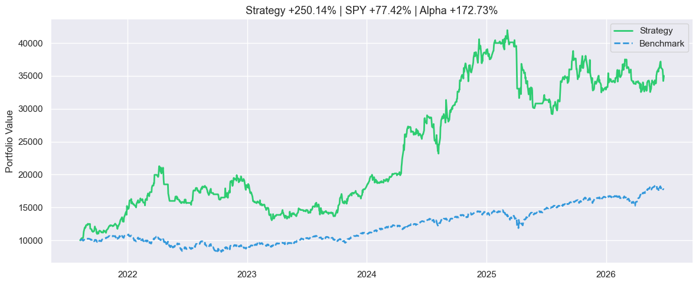
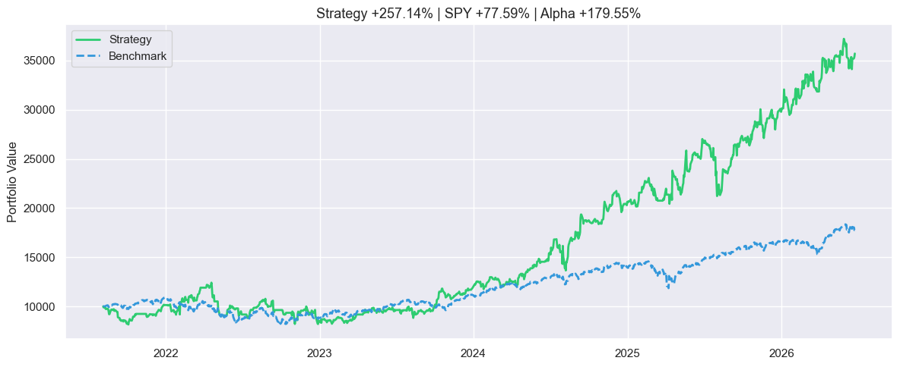

# Finance Project

<div align="center">
  
</div>

## Table of Contents
- [Overview](#overview)
- [Features](#features)
- [Results](#results)
- [Reflection](#reflection)
- [Resources](#resources)
- [Appendix](#appendix)

## Overview
This project was originally intended as a way for me to learn some Python first-hand, but has quickly developed into a mashup of various fields that I'm interested in: computer science, finance, and machine learning. The project itself can also be thought of as a sort of playground for my thoughts and observations, some of which I have recorded in my [journal](/journal.txt); this has produced my final project, a backtesting model for a portfolio of stocks that uses a Random Forest Classifier machine learning model fed with certain features that successfully outperformed the S&P 500 by $+250.17\%$ using 5 years of training data followed by 5 years of testing.

In the process of this journey, I've achieved some proficiency in the following:
1. Virtual Environments
2. Github Committing, Pushing, .gitignore, etc.
3. Pandas & Dataframes
4. Jupyter Notebooks for documenting and displaying results
5. YFinance
6. matplotlib.pyplot and seaborn libraries for graphs
7. Various Python tools, libraries, and conventions, especially regarding object-oriented programming
8. Solving problems through testing hypotheses and evaluating results using code
9. Various tools, calculations, indices, and measurements for quantifying stocks

I have left most of the Python files from previous trials and iterations intact to preserve the process; the important ones are listed first here:
1. [notebooks](/notebooks): this contains all of my Jupyter notebooks, and is my record of learning syntax and "getting things to work." Among these, 04: model_testing is where my models were tested, graphs were made, and stock pools incorporated. 05: stock_pool is an attempt to account for overfitting, which will be addressed in more detail later.
2. [simulations](/src/simulations): backtest_portfolio_v2.py is my full final model, with the ability to pick the best stock out of a given pool (or sit in cash). backtest_single_v1.py was my original backtesting model, which only traded one stock (determined whether to buy or sit in cash).
3. [indicators.py](/src/indicators.py): I put the formulas for calculating the features in here; creating new features is super easy because I can just put the function in here and add it to the features dictionary.
4. [stock_screener.py](/src/stock_screener.py): This probably should've been just a single function in the actual model file (the other functions don't end up being used) but I decided to use it to get the data for all of the stocks in the entire project.

## Features
Our backtesting model [backtest_portfolio_v2.py](/src/simulations/backtest_portfolio_v2.py) uses the Random Forest Classifier from scikit-learn's ensemble; I chose this model over other models such as XGBClassifier (Gradient), Linear Regression, and Logistic Regression because it was both complex enough (and customizable) to calculate all of the data while simultaneously being simple enough to understand; a more complete explanation of how the RFC model applies to this project context specifically can be found in [the Appendix](#random-forest-classifier).

There are a wide variety of features and conditions that I considered implementing into this model; they are listed, along with whether or not I included them and their given values (if any) below:

| Name | Description | Implemented |
|:-----|:-----|:-----|
| confidence_threshold | RFC returns a specific probability/confidence level for each guess (proba is a natural function/result of RFC). Must cross $x$ to execute trade (if none then sits in cash) | $0.60$ |
| bear_confidence_threshold | If market (benchmark stock) is in a downtrend, we increase the normal confidence threshold to $x$ | $0.75$ |
| adx_threshold | [ADX: Average Directional Index](#adx-average-directional-index) measures trend strength, important when most of our features are measures of trend. ADX must be greater than $x$. | $20$ |
| min_hold_days | A stock must be held for at least $x$ days to prevent choppy stocks from constantly overtaking each other. This makes results easier to interpret. | $7$ |
| stop_loss | If the stock we are invested in has lost $x$ (proportion) of its value since buying, disregard min_hold_days and immediately sell position. This counteracts the main weakness of min_hold_days. | $0.10$ |
| sma_position | Calculates SMA: Simple Moving Average and compares it to price. Measures how far the price is from its average value over the last $x$ days | $10, 30$ |
|sma_trend_regime | Calculates two SMA positions with windows $x_1, x_2$ and their relationship (binary=True returns $0$ or $1$ depending on which one is higher) | $(10, 30)$ |
| rsi | [RSI: Relative Strength Index](#rsi-relative-strength-index) calculates momentum of a stock (overbought or oversold). RSI is orthogonal to SMA in the sense that SMA position tells you where price is relative to its average and RSI tells you how aggressively it got there. Our RSI is calculated over the last $x$ days. | $14$ |
| bollinger_position | [Bollinger Position](#bollinger-position) measures where price sits within its volatility band. It is volatility-normalized, so it complements RSI well. Window of data taken is $x$; Upper & lower bands are located $y$ standard deviations above SMA. | $(20, 2)$ |
| price_roc | Simply calculates the rate of change of price over the last $x$ days. | $1, 5$ |

### Feature Analysis

Our features can be split into two groups:
1. **Features:** In the conventional usage of the word in machine learning, these are things that are directly fed into our model. These include the latter few features: sma_position (slow & fast), sma_trend_regime, rsi, bollinger_position, and price_roc (slow & fast).
2. **Pre-selection screening:** These are checks that tell us whether to buy or sell and are thresholds put into the simulation itself, and do not impact the model's results themselves. These include confidence_threshold (bear & normal), adx_threshold, min_hold_days, and stop_loss.

For the first group, I used StandardScaler from scikit-learn's preprocessing in order to make sure all of my features were accounted for equally. SMA looks at distance from the long-term average, RSI looks at the consistency of up vs down days, Bollinger Position normalizes the price in relation to volatility, and ROC is a good short-term measure of recent momentum. My features cover both the short-term and medium-term growth of a stock.

The second group artificially limits the trades the model wants to make by cutting out some of the "noise" that it might encounter. For example, some stocks oscillate between a certainty of below 0.50 and above 0.50, meaning that it's just better to stay in cash unless the model extremely accurate. The ADX threshold was perhaps the most important, as it makes sure the trends that we notice with the model are actually stable. The holding requirement and stop loss were there for stability, as well as limiting trades; in the real world, commissions pile up if we end up trading every day.

## Results

My model acted on a medium-sized pool of 15 stocks

```python
ticker_pool_balanced = [
    "NVDA", "LLY", "JPM", "GLD", "WMT",
    "MSFT", "AMZN", "PG",  "UNH", "XOM",
    "INTC", "PFE", "DIS",  "BABA", "T"
]
```

that I screened for a balance of overperformers, underperformers, and stable stocks through [05_stock_pool.ipynb](/notebooks/05_stock_pool.ipynb). It simulated a day-by-day buy-or-sell strategy through 5 years of testing data (2021-06-28 to 2026-06-26) with a training window of 5 years as well (2016-06-27 to 2021-06-25). The detailed trade log can be found in [04_model_testing.ipynb](/notebooks/04_model_testing.ipynb). Over this period of 5 years, the model experienced a return of $+250.14\%$ ($\sim3.5\times$), outperforming the benchmark S&P 500 (SPY) and generating an alpha of $+172.73\%.$ It executed 153 total trades at an average of around one trade every 12 days, and had a winrate on trades of $54.90\%$.

## Reflection

Overall, I consider this project to be successful, as it allowed me to get some experience working with Python, pandas dataframes, building features and labels for machine learning, and importing data from external sources (yfinance). My final results were great, and I beat my goal of outperforming the S&P 500 by a substantial margin. From looking at the graph, this strategy is stable as well, boasting a pretty nice sharpe ratio (from eyeballing). However, there are a few areas that I found to be more challenging to implement or understand, as well as a few areas that I found personally quite interesting:

### Overfitting

This was a recurring problem that I found myself facing closer to the end of this project when I was trying to tweak the values of the features to optimize the model. Because I had never done anything like this with optimizing models before, I thought I could get away with just tweaking values and choosing the best ones; however, luckily, offsetting the model by a few years provides a quick and easy way to get a lot of results data, and I quickly found out that some of the signals I was getting were incorrect. An example of this was when tweaking min_hold_days: because this variable has a large impact on what trades the model is able to make, it was able to seemingly give me very good results; however, none of these proved to hold. This actually makes sense, as it's mainly there to prevent the model from being too choppy.

Another particularly notable example of this was in choosing the actual pool of stocks that my simulation would consider. Since I would have to download all of the stocks from yfinance and train the model on my computer every single time (I heard of a technique called pickling but never got around to using it because my results changed as I changed the model), I had to limit the model to pick the best stock for each day out of a shortened list. My original plan was to pick a group of 15 tech stocks:

```python
ticker_pool_tech = [
        "NVDA", "MSFT", "AVGO", "NOW",
        "ORCL", "AAPL", "TEAM", "INTC",
        "SNOW", "WIX",  "AMD",  "CSCO",
        "SHOP", "AMZN", "CRM", "QQQ"
]
```

I had been interested in that sector for a while, and it seemed like the decision wasn't too important. However, there were two problems with this:
1. Choosing stocks only from one sector means my results are heavily dependent on how well the sector as a whole does. Since most of my testing data was on the past 10 years (even offset), I was bound to see positive results because tech as a whole did well over those few years.
This was a very tough problem for me to actually catch in the first place, and I only realized this near the end. I then tried to pick stocks from varying sectors:

```python
ticker_pool_general = [
    "NVDA", "MSFT", "AAPL", "AMZN", "GOOGL",
    "UNH", "LLY", "JNJ",
    "XOM", "CVX",
    "JPM", "BRK-B",
    "WMT", "PG",
    "GLD", "SPY"
]
```

This set of stocks, however, suffered from the second issue:

2. All of the stocks that I chose suffered from survivorship bias; the more well-known ones were well-known because they performed well, and thus it would've been hard for my model to *not* see positive results.

So, I wrote up some code in [05_stock_pool](/notebooks/05_stock_pool), and finally came up with the following:

```python
ticker_pool_balanced = [
    "NVDA", "LLY", "JPM", "GLD", "WMT",
    "MSFT", "AMZN", "PG", "UNH", "XOM", 
    "INTC", "PFE", "DIS", "BABA", "T"
]
```

This pool of stocks features some stocks that did well (in particular LLY & NVDA), some that didn't do very well (BABA, DIS), and some that didn't change by a lot (PG, UNH).

### Model Limitations

Problems with overfitting aside, there were a few limitations with my model that I had attempted to fix but was unsuccessful. The main limitation my model has currently is the variability in its trading (measured by the sharpe ratio). I chose to make my model only choose one stock to trade each day instead of splitting its capital amongst a top-$n$ stocks kind of approach because it was much easier to code and log trades; however, this came at a downside of choppier swings and instability. While there wasn't really a lot of drawdown that we saw, the overall equity curve of our portfolio isn't exactly a paragon of consistency.

Another limitation that my model has is the inability to account for real-world trading issues like slippage and trading commissions. Because I wasn't exactly well-versed in finance and trading before this point, I didn't know how to incorporate these in an accurate and fair manner, so I ultimately ended up not including them.

Finally, the last big limitation my model has is a lack of transparency with regards to its decision-making process. Even though the Random Forest Classifier model is easy to understand and works well considering I don't have extensive knowledge of finance and markets, my trade-off was that I wasn't able to tweak how much each feature mattered and directly see the impact that each one had on my trades.

### Other Challenges

There are various other challenges that I faced throughout this project, mostly related to the fact that this was designed as a project to first and foremost improve my understanding of both coding as well as finance and trading. For example, I couldn't fix the problem of overfitting as conclusively as I thought I could, because I couldn't do batch-testing into neat final return arrays because of my limited coding skills.

For the finance side of things, I was mainly shocked by the number of things I just couldn't understand or explain at first; for example, one of the earlier simulations I had run with the backtesting model resulted in the following graph:

<div align="center">
  
</div>

As can clearly be seen, the first few years saw my model perform around the same as the S&P 500 benchmark, but the next few years saw a huge increase in returns. Surprisingly, I found myself drawing parallels to competition math, and I had to think about each problem in my data, even if it led to positive results, and find out what was causing them to happen. In this case, my theory is that since most of my features in my model are related to tracking trends, the first few years the market was pretty choppy, leading my signals to be more inconsistent; this can be seen by the more stagnant benchmark curve. The latter years were where the market really started to show an uptrend, which is why my model performed better.

## Resources

Throughout my journey, I used various tools and resources to help me learn coding syntax and introduce me to finance concepts:
- [Sentdex's YouTube Channel](https://www.youtube.com/@sentdex) has a lot of very helpful tutorials on Python, Pandas, and most importantly machine learning, though RFC is not covered in his ML course.
- [This YouTube video on the Sharpe Ratio](https://www.youtube.com/watch?v=9HD6xo2iO1g) helped me a lot in interpreting and approaching my results in terms of a unified framework.
- [Neurotrader](https://www.youtube.com/@neurotrader888) has some excellent videos on overfitting, amongst a lot of other very useful content
- [Random Forest Classifier Video](https://www.youtube.com/watch?v=v6VJ2RO66Ag) I used that is very clear and informative
- **AI Disclaimer:** There were times when I wanted to do things that I didn't learn though these videos; anything not covered by the above was answered pretty handily with Google or LLMs Gemini & Claude. However, I made certain to put comprehension first, and all design decisions and non strictly syntax-related issues were solved by me, as well as all of the code that went into the final model (minus generating some stocks for testing purposes). AI usage does come with risks, and some of those risks did manifest in my project as problems I had to solve later down the line, but I would be putting myself at a disadvantage if I didn't use AI in 2026.

## Appendix

There are a few aspects of the project that should be explained in a more technical manner, which I do below:

### Random Forest Classifier
> *\*Note: This section is largely based off of two videos by Normalized Nerd: [one on decision trees](https://www.youtube.com/watch?v=ZVR2Way4nwQ) and [one on random forest](https://www.youtube.com/watch?v=v6VJ2RO66Ag)*

To understand how the Random Forest Classifier model works, we first need to understand **decision trees**. In a nutshell, decision trees are a specific tool used to classify points into groups, typically $0$ or $1$; in this project, $0$ represented sell and $1$ represented buy. Just like all machine learning models, decision trees classify unseen points into categories by predicting which category they will fall in based on given training data whose classifications they already know; this is the training process. 

Of course, directly asking the model to do this would be quite hard, so the way the model identifies trends and improves its likelihood of guessing $0$ or $1$ correctly has to do with **features**, values for different things that we give to the model. For example, suppose we set the [Relative Strength Index (RSI)](#rsi-relative-strength-index) as a feature, and the model noticed that every time $RSI \leq 30$, the stock grew. Then, the model would obviously give a buy signal whenever a point in the testing data had an $RSI \leq 30$. The difference between Random Forest and other machine learning models, therefore, is in how they are trained and how they classify unseen points.

To better illustrate decision trees, therefore, we can consider them from two perspectives: testing (unseen) data and training data:
1. **Testing data.** Suppose we have a testing point $p$ with values for features $x_0, x_1, x_2, \dots$. We start at a node called the **root node**. At every node, we have a question that returns a boolean result. In the context of this problem, we use numbers, so they are typically simple comparisons like $x_n \geq y$ for $y \in \mathbb{R}$. After answering each question at a node, we move on to each of two child nodes: one for if the answer to the question returned True, and one for if the question returned False. We will either end up at a **leaf node**, which tells us to return $0$ or $1$, or we end up at a **branch node**, which asks us another question. We continue until we reach a leaf node.
2. **Training data.** Now we will consider how a decision tree is built off of training data. We must start by constructing the root node. We take the set of all possible questions we could ask (Technically since $y \in \mathbb{R}$ there are infinitely many so we restrict it to a finite set of splits by only considering values that actually appear in the training data. So for a feature $x_n$ with values $v_0, v_1, \dots v_n$, the only splits worth considering are $x_n \geq v_0, x_n \geq v_1, \dots x_n \geq v_n.$), and and pick the best one. How do we select the best one? We pick the one with the most information gain, as that will be the one with the most useful split. How do we quantify this information gain? Using **Entropy** $E = \sum - p_i \log_2(p_i)$ for $p_0 = \text{probability of being 0}$ and $p_1 = \text{probability of being 1}$ (this is generalizable). We calculate the entropy for both of each potential split's child nodes (True and False), and combine them into the Informaion Gain $IG = E(parent) - \sum w_i \cdot E(child_i)$, from which we select the highest value. Note that each "question" comes with both a single feature $x_n$ as well as a comparison.

So, why do we need Random Forest if normal decision trees already allow us to classify data points? Well, as it turns out, decision trees are highly sensitive to data points, and just changing one of them can lead to the entire tree changing; this is because a difference in one node disrupts all of its child nodes as well. So, our idea is to make a bunch of different decision trees to get together and vote on a consensus, which will be much more informative (a bunch of trees is called a forest). The problem with this idea is that decision trees are hardcoded to generate in a certain way, so we'll just end up with a bunch of copies of the same tree! (and our forest will be very boring and susceptible to disease)

To fix this issue, we randomize parts of our decision tree generation to guarantee that they will be different:
1. **Bootstrapping.** Instead of training every tree on the full training set, each tree gets a random sample with replacement of the training data. So if you have 1000 training rows, each tree might see 1000 rows but some are duplicated and some are missing entirely. This means every tree sees a slightly different version of the data and learns slightly different patterns.
2. **Feature Selection.** At each split in each tree, instead of considering all features, the tree only considers a random subset of features. This is crucial because without it, all trees would tend to use the same strong features at the top of every tree, making them highly correlated with each other and defeating the purpose of having many trees.

After we generate our random trees, we need to make them vote on which signal to send, $0$ or $1$. For normal classification, each tree votes and the majority wins. For our model, we return a confidence level, which uses the `predict_proba` function and averages the probabilities across all of the trees:

$$P(\text{buy}) = \frac{1}{n} \sum^{100}_{i=1} P_i(\text{buy}).$$

Now we can take a look at Random Forest in the context of our model:

```python
rf_classifier = ensemble.RandomForestClassifier(
        n_estimators=100,
        random_state=42,
        min_samples_split=10,
        max_features='sqrt',
        max_depth=10
)
```

I decided to go with normal values for each of the coefficients; they are explained below:

| Name | Value | Explanation |
|:-----|:-----|:-----|
| n_estimators | $100$ | $100$ decision trees were made in total |
| random_state | $42$ | Seeds the random number generator so we get the same random results each time. $=42$ because it's the answer |
| min_samples_split | $10$ | Prevents overfitting by stopping it from splitting if there are less than $10$ values left (forces leaf node) |
| max_features | 'sqrt' | When selecting out of $n$ features, select up to $\sqrt{n}$ features for each tree at each node. |
| max_depth | $10$ | Limits number of questions asked to $10$ (could still be $2^10 = 1024$ leaves possible so this isn't really limiting) |

### ADX (Average Directional Index)

ADX measures **trend strength**. Note that this is independent from the direction the stock is predicted to go. In my model, stocks must pass both the confidence filter as well as the ADX threshold, which ensures that stocks selected are both predicted to rise in value as well as making sure that this trend should hold in the future. To calculate ADX, the following steps are performed:
1. True Range $TR = \max(h - l, |h - c_p|, |l - c_p|)$, where $h$ is the high, $l$ is the low, and $c_p$ is the previous day's close. This tells us how big the price range really was.
2. Average True Range $ATR$ is obtained by smoothing $TR$ using [EWM (Exponential Weighted Moving Average)](#ewm-exponential-weighted-moving-average). Note: EWM is built into pandas: `atr = tr.ewm(com=window - 1, adjust=False).mean()`
3. Directional Movements $DM_+$ and $DM_-$, where $DM_+$ is the difference in highs and $DM_-$ is the difference in lows. Note that $DM_+, DM_- \geq 0$ by design. On each day, we take the greater of these as the overall directional movement and set the other one to $0$, and then take the EWM of each. In this way, each day will have a nonzero value for each $DM_+$ and $DM_-$, because previous days would've had nonzero $DM$ even if the current day's $DM$ was set to $0$.
4. Directional Indicators $DI_+ = 100 \cdot \frac{DM_+}{ATR}$ and $DI_- = 100 \cdot \frac{DM_-}{ATR}$ are calculated. Dividing by $ATR$ normalizes $DM$, allowing it to be comparable across stocks.
5. Directional Index $DX  = 100 \cdot \frac{|DI_+ - DI_-|}{|DI_+ + DI_-|}$
6. $ADX$ = smoothed $DX$ by EWM again.

Intuitively, if $DI_+$ and $DI_-$ are close together, the stock is going nowhere and we have a low $ADX$. If one dominates the other strongly, the stock is trending hard, which leads to a high $ADX$. Below is the flowchart for the entire process (I couldn't get both $DM_+$ and $DM_-$ to show up so this is just one branch):

$$DM_+ \xrightarrow{\text{EWM}} +\widetilde{DM} \xrightarrow{\div ATR} DI_+ \rightarrow DX \xrightarrow{\text{EWM}} ADX$$

Currently, the model filters out stocks with an $ATR < 20$, which is a weak trend.

### RSI (Relative Strength Index)

RSI measures **momentum**, and measures how aggressively price has been moving up vs down over the past 14 days. Calculating RSI is easier than ADX:
1. Calculate gain $g$ and loss $l$ for each day. For example, if a stock grows $\$3$, $g = 3$ and $l = 0$.
2. Smooth both with EWM `avg_gain = gains.ewm(com=window - 1, adjust=False).mean()`
3. Relative strength $RS = \frac{g}{l}$.
4. $RSI = 100 - \left(\frac{100} {1 + RS}\right)$ to put it on an index of 0-100.

### Bollinger Position

Bollinger Position measures where price relative to **volatility**. To calculate it is simple:
1. Simple Moving Average `sma = close.rolling(window).mean()`
2. Standard Deviation `std = close.rolling(window).std()`. Luckily, pandas has us covered for both of these.
3. Bollinger Position
$$BP = \frac{\text{close} - SMA}{\text{std} \cdot \text{num\_std}}$$

### EWM (Exponential Weighted Moving Average)

EWM is a way to smooth out functions to avoid large jumps or shifts in values. Compared to a simple rolling average, EWM weights days that are more recent more heavily (exponentially heavier in fact!) compared to those that are further away.

In the context of [ATR](#adx-average-directional-index), we obtain

$$ATR_t = \frac{1}{n} \sum^{n-1}_{i=0} w_i \cdot TR_{t-i},$$

where $w_i$ are the decaying weights. With EWM, the weights decay at the rate of

$$w_i = \left(1 - \frac{1}{n}\right)^i$$

Note: In the code, I used `adjust=False`. If set to `True`, this function would divide by the sum of weights $\sum^{t}_{i=0} w_i$ to correct for the fact that earlier observations have fewer past values to average over.